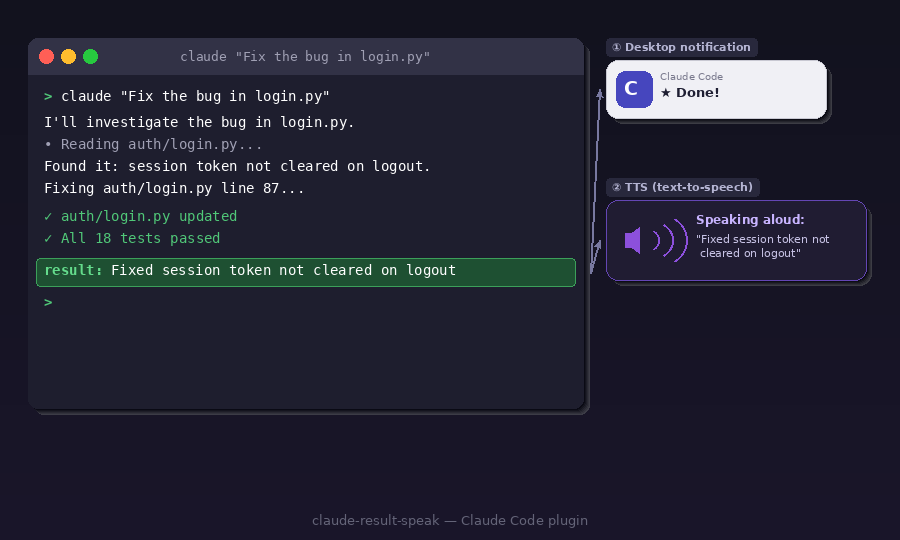

# claude-result-speak

Claude Code の応答を音声で読み上げ、デスクトップ通知を送るプラグインです。



## 機能

- **TTS** — 応答の最後の一文を自動で読み上げ
- **デスクトップ通知** — 応答完了・権限確認・入力待ちを通知
- **`result:` サマリー** — Claude が毎回の応答末尾に1行サマリーを追記し、それを読み上げ
- **クロスプラットフォーム** — macOS・Windows（WSL2）対応

## 必要環境

| プラットフォーム | 必要なもの |
|----------------|-----------|
| macOS | Python 3、標準搭載の `say` コマンド |
| WSL2 | Python 3、`powershell.exe`（標準搭載） |

## インストール

```bash
claude plugin marketplace add https://github.com/qvtec/claude-result-speak.git
claude plugin install claude-result-speak@claude-result-speak
```

次に、プラグインを有効化します：

```bash
# 全プロジェクトで使う場合（推奨）
claude plugin enable --scope user claude-result-speak@claude-result-speak

# 現在のプロジェクトのみ
claude plugin enable --scope project claude-result-speak@claude-result-speak
```

## 仕組み

付属の `CLAUDE.md` により、Claude はすべての応答の最後に以下の形式で1行サマリーを書きます：

```
result: <応答内容の要約>
```

`Stop` フックが発火すると、このプラグインがその行をTTSで読み上げます。

## プラットフォーム別動作

| 機能 | macOS | Windows (WSL2) |
|------|-------|----------------|
| TTS | `say -v Kyoko -r 250` | PowerShell SpeechSynthesizer |
| 通知 | `osascript` | PowerShell バルーン通知 |
| 完了音 | Blow | Asterisk |
| 権限確認音 | Pop | Exclamation |
| 待機音 | Tink | Beep |

## カスタマイズ

`~/.claude/settings.json` に `env` ブロックを追加します：

```json
{
  "env": {
    "CLAUDE_RESULT_SPEAK_LANGUAGE": "ja",
    "CLAUDE_RESULT_SPEAK_TTS_ENABLED": "true"
  }
}
```

| 環境変数 | 型 | デフォルト | 説明 |
|---------|-----|-----------|------|
| `CLAUDE_RESULT_SPEAK_TTS_ENABLED` | boolean | `true` | 読み上げの有効/無効 |
| `CLAUDE_RESULT_SPEAK_NOTIFY_ENABLED` | boolean | `true` | デスクトップ通知の有効/無効 |
| `CLAUDE_RESULT_SPEAK_LANGUAGE` | string | `en` | 通知メッセージの言語 (`ja` / `en`) |
| `CLAUDE_RESULT_SPEAK_MESSAGE_COMPLETE` | string | _(言語デフォルト)_ | 完了メッセージのカスタマイズ |
| `CLAUDE_RESULT_SPEAK_MESSAGE_PERMISSION` | string | _(言語デフォルト)_ | 権限確認メッセージのカスタマイズ |
| `CLAUDE_RESULT_SPEAK_MESSAGE_IDLE` | string | _(言語デフォルト)_ | 入力待ちメッセージのカスタマイズ |
| `CLAUDE_RESULT_SPEAK_VOICE_MAC` | string | `Kyoko` | macOSの音声名 (例: `Alex`, `Samantha`) |
| `CLAUDE_RESULT_SPEAK_VOICE_WINDOWS` | string | _(システムデフォルト)_ | Windows (WSL2) の音声名 (例: `Microsoft Haruka Desktop`) |
| `CLAUDE_RESULT_SPEAK_RATE_MAC` | number | `250` | macOSの読み上げ速度・WPM (50〜500) |
| `CLAUDE_RESULT_SPEAK_RATE_WINDOWS` | number | `3` | Windows (WSL2) の読み上げ速度 (-10〜10) |
| `CLAUDE_RESULT_SPEAK_MAX_CHARS` | number | `200` | 読み上げる最大文字数 (50〜500) |
| `CLAUDE_RESULT_SPEAK_SOUND_COMPLETE` | string | `Blow` | 完了通知のmacOS通知音 |
| `CLAUDE_RESULT_SPEAK_SOUND_PERMISSION` | string | `Pop` | 権限確認通知のmacOS通知音 |
| `CLAUDE_RESULT_SPEAK_SOUND_IDLE` | string | `Tink` | 入力待ち通知のmacOS通知音 |
| `CLAUDE_RESULT_SPEAK_EMOJI_COMPLETE` | string | `✨` | 完了通知の絵文字 |
| `CLAUDE_RESULT_SPEAK_EMOJI_PERMISSION` | string | `⚠️` | 権限確認通知の絵文字 |
| `CLAUDE_RESULT_SPEAK_EMOJI_IDLE` | string | `💬` | 入力待ち通知の絵文字 |

選択できるmacOS通知音: `Basso` `Blow` `Bottle` `Frog` `Funk` `Glass` `Hero` `Morse` `Ping` `Pop` `Purr` `Sosumi` `Submarine` `Tink`

## 関連プラグイン

### [claude-result-speak-pet](https://github.com/qvtec/claude-result-speak-pet)

通知をデスクトップペット（アニメーション猫）で届けるビジュアル版の通知プラグインです。  
このプラグインと組み合わせて使うと、音声読み上げ＋ペット表示の両方を楽しめます。

その場合、このプラグインのバルーン通知と重複しないよう `CLAUDE_RESULT_SPEAK_NOTIFY_ENABLED` を無効にしてください：

```json
{
  "env": {
    "CLAUDE_RESULT_SPEAK_NOTIFY_ENABLED": "false"
  }
}
```

## ライセンス

MIT
